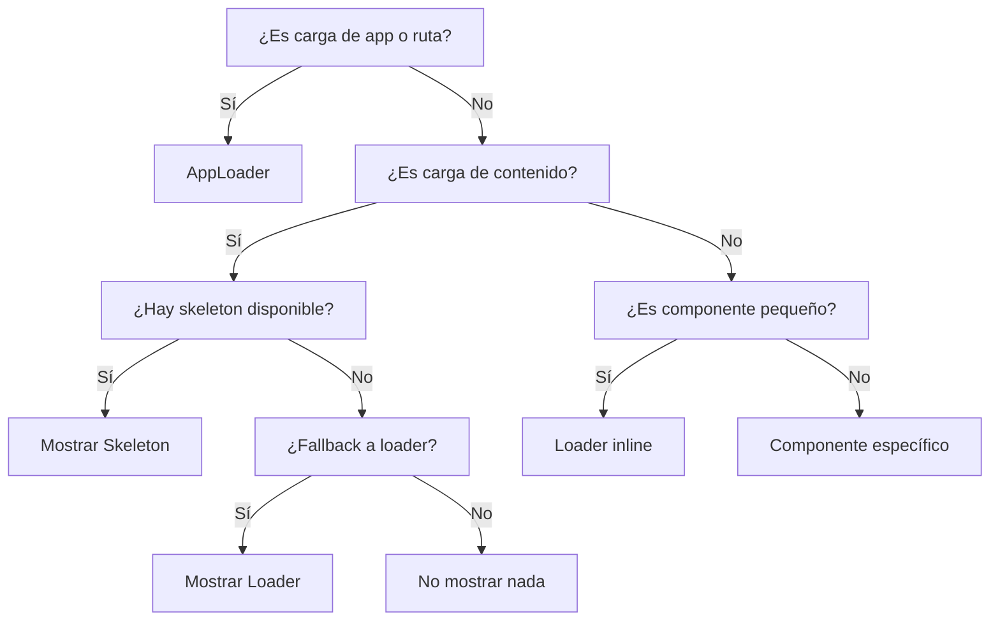

# 🚀 Arquitectura de Loading States - Unificada

## 📋 Resumen

Esta arquitectura proporciona una estrategia clara y consistente para manejar estados de carga en toda la aplicación, priorizando skeletons cuando es posible y usando loaders como fallback. **Los componentes de loading se han unificado para simplificar la arquitectura.**

## 🏗️ Componentes Principales

### 1. **Loader Base** (`src/shared/components/ui/loader.tsx`)

Componente base de shadcn para spinners animados.

```tsx
import { Loader } from '@/shared/components/ui';

// Uso básico
<Loader />

// Con variantes
<Loader variant="verifying" size="lg" />

// Fullscreen
<Loader fullScreen variant="initializing" />
```

### 2. **AppLoader** (`src/shared/components/custom/AppLoader.tsx`)

**Componente unificado** para inicialización de app y carga de rutas.

```tsx
import { AppLoader } from '@/shared/components';

// Inicialización de app
<AppLoader variant="app-init" />

// Carga de rutas (Suspense)
<AppLoader variant="route-load" />

// Error con acciones
<AppLoader 
  variant="error" 
  actions={<button>Recargar</button>} 
/>
```

### 3. **ContentLoader** (`src/shared/components/custom/ContentLoader.tsx`)

Para carga de contenido con estrategia skeleton-first.

```tsx
import { ContentLoader } from '@/shared/components';

<ContentLoader
  isLoading={isLoading}
  skeleton={<DashboardSkeleton />}
  fallbackVariant="skeleton" // skeleton | loader | none
  loadingOptions={{ delay: 200, minLoadingTime: 500 }}
>
  {/* Contenido */}
</ContentLoader>
```

## 🎯 Estrategia de Loading por Contexto

### **1. App Loading (AppInitializer + Router)**

- **Cuándo**: Inicialización de app, lazy loading de rutas
- **Componente**: `AppLoader`
- **Variantes**: `app-init`, `route-load`, `error`
- **Características**: Fullscreen, unificado, acciones de error

### **2. Content Loading (API calls)**

- **Cuándo**: Carga de datos, llamadas API
- **Componente**: `ContentLoader`
- **Características**: Prioriza skeletons, fallback configurable

### **3. Component Loading (Suspense local)**

- **Cuándo**: Lazy loading de componentes específicos
- **Componente**: `Loader` + `Skeleton`
- **Características**: Skeleton del componente o loader inline

## 📊 Cuándo Usar Cada Tipo

### **AppLoader (Unificado)**

```tsx
// ✅ Para inicialización de app
<AppLoader variant="app-init" />

// ✅ Para lazy loading de rutas (Suspense)
<Suspense fallback={<AppLoader variant="route-load" />}>
  <Routes />
</Suspense>

// ✅ Para errores de app
<AppLoader variant="error" actions={...} />
```

### **Skeletons**

```tsx
// ✅ Para contenido estructurado (páginas, listas, cards)
<DashboardPageSkeleton />
<CardSkeleton />
<ListSkeleton />

// ✅ Para formularios
<AuthFormSkeleton />

// ❌ NO para inicialización de app
// Usar AppLoader en su lugar
```

### **Loaders**

```tsx
// ✅ Para componentes pequeños
<Loader size="sm" />

// ✅ Como fallback en ContentLoader
<ContentLoader fallbackVariant="loader" />

// ✅ Para loading inline
<Button disabled={isLoading}>
  {isLoading && <Loader size="sm" />}
  Login
</Button>
```

## 🔄 Flujo de Decisión Simplificado



## 📝 Ejemplos de Implementación

### **Página con API calls**

```tsx
export default function DashboardPage() {
  const { user, isLoading } = useAuth();
  const { data: stats, isLoading: statsLoading } = useStats();

  return (
    <ContentLoader
      isLoading={!user || statsLoading}
      skeleton={<DashboardPageSkeleton />}
    >
      <DashboardContent user={user} stats={stats} />
    </ContentLoader>
  );
}
```

### **Componente con Suspense**

```tsx
const HeavyChart = lazy(() => import('./HeavyChart'));

function DashboardContent() {
  return (
    <Suspense fallback={<ChartSkeleton />}>
      <HeavyChart />
    </Suspense>
  );
}
```

### **Formulario con loading**

```tsx
export function LoginForm() {
  const [isLoading, setIsLoading] = useState(false);

  return (
    <form>
      <Input disabled={isLoading} />
      <Button disabled={isLoading}>
        {isLoading && <Loader size="sm" />}
        Login
      </Button>
    </form>
  );
}
```

## 🔍 Análisis Detallado

### **AppInitializer - ¿Qué hace realmente?**

**Proceso unificado de inicialización:**

1. **Verificación de archivos**: `/index.html`, `/manifest.webmanifest`, `/sw.js`
2. **Detección de errores**: MIME type, módulos corruptos
3. **Recuperación automática**: Limpieza de caché, recarga
4. **Tiempo total**: ~2-3 segundos en casos normales

### **RouteLoader - ¿Cuándo se muestra realmente?**

**Casos donde se muestra:**

1. **Primera carga de ruta lazy**: Navegación a página nunca cargada
2. **Red lenta**: Chunk tarda en descargarse
3. **Dispositivos lentos**: Parsing/ejecución de JS lenta

**En la práctica**: Con Vite y chunks pequeños, raramente visible en producción.

### **¿Por qué se unificaron?**

1. **Duplicación**: `InitialLoader` y `RouteLoader` eran muy similares
2. **Simplicidad**: Un solo componente para loading de app
3. **Consistencia**: Mismo diseño y comportamiento
4. **Mantenibilidad**: Menos código para mantener

## 🎨 Personalización

### **Crear Skeleton Personalizado**

```tsx
export function CustomSkeleton() {
  return (
    <div className="animate-pulse space-y-4">
      <div className="h-4 bg-gray-200 rounded w-3/4" />
      <div className="h-4 bg-gray-200 rounded w-1/2" />
    </div>
  );
}
```

### **Configurar Loading Options**

```tsx
<ContentLoader
  isLoading={isLoading}
  loadingOptions={{
    delay: 300,        // Delay antes de mostrar
    minLoadingTime: 800 // Tiempo mínimo visible
  }}
>
  {/* Contenido */}
</ContentLoader>
```

## 🚀 Mejores Prácticas

1. **Prioriza Skeletons**: Siempre que sea posible, usa skeletons para contenido estructurado
2. **Usa AppLoader**: Para inicialización de app y carga de rutas
3. **Configura Delays**: Evita parpadeos con delays apropiados
4. **Mantén Consistencia**: Usa los mismos patrones en toda la app
5. **Optimiza UX**: Considera el tiempo mínimo de loading para evitar parpadeos

## 🔧 Migración

### **De arquitectura anterior a unificada:**

```tsx
// ❌ Antes
<InitialLoader variant="verifying" />
<RouteLoader variant="page" />

// ✅ Después
<AppLoader variant="app-init" />
<AppLoader variant="route-load" />
```

### **De LoadingWrapper a ContentLoader:**

```tsx
// ❌ Antes
<LoadingWrapper
  isLoading={isLoading}
  skeleton={<Skeleton />}
  useSkeleton={true}
>

// ✅ Después
<ContentLoader
  isLoading={isLoading}
  skeleton={<Skeleton />}
  fallbackVariant="skeleton"
>
```

## 📚 Referencias

- [React Suspense Documentation](https://react.dev/reference/react/Suspense)
- [Shadcn UI Skeleton](https://ui.shadcn.com/docs/components/skeleton)
- [Loading UX Best Practices](https://web.dev/loading-ux/)
